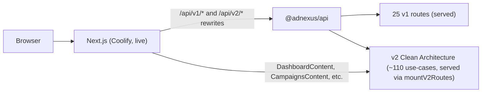

# AdNexus AI — Path to v1

> Status date: 2026-06-10
> Branch where the original audit landed: `fix/api-test-suite-green-2026-06-02`
> Supersedes the "Phases 1-5 COMPLETE" claims in [V2-ROADMAP.md](../V2-ROADMAP.md)
> (those were aspirational at the time — the test suite was red and v2 was not yet served).

This document is the single source of truth for what is actually done, what is
genuinely broken, and the prioritized path to a shippable v1. Every item has a
status, an owner-area, a test gate, and acceptance criteria.

## Where we are now (verified, not aspirational)

| Area | State |
|---|---|
| API tests (jest) | GREEN — integration, unit, and e2e suites under `apps/api/tests/` |
| API use-case tests (vitest) | GREEN — ~30 files under `src/application/use-cases/`, run by `pnpm --filter @adnexus/api test` |
| v2 integration tests | GREEN — `v2-campaigns`, `v2-settings-api-keys`, `v2-reports-dashboard` hit served `/api/v2/*` |
| Web tests (vitest RTL) | GREEN — Next component tests for live dashboard surfaces |
| Playwright smoke (root) | GREEN on `main` — `pnpm test:smoke` (`playwright.config.ts`) |
| Typecheck (all packages) | GREEN |
| Web build + Docker image | GREEN — boots, Coolify artifact valid |
| API Docker image | GREEN — builds from root context, boots, `GET /health` 200 |
| **v2 Clean Architecture at runtime** | **DONE — see P0-1** (`mountV2Routes` in `apps/api/src/index.ts:256`) |
| **API production deploy** | **Mostly done — see P0-2** (`adnexus-api` Coolify app live; env tuning may remain) |
| **Total test files (repo)** | **77** `.test.ts` / `.test.tsx` files across API, web, and packages |

See [architecture/test-coverage-matrix.md](architecture/test-coverage-matrix.md)
for the full coverage breakdown and the structural findings.

## Runtime architecture (current)



The live Next dashboard calls `/api/v2/*`; the deployed API entrypoint
(`apps/api/src/index.ts`) mounts both v1 routers and v2 routes via
`mountV2Routes(app)` at line 256. Preview URLs:

- Web: `https://adnexus-ai.apps.softblaze.net`
- API: `https://adnexus-api.apps.softblaze.net`

---

## P0 — Ship blockers (must be done for v1)

### P0-1 — Wire the v2 Clean Architecture into the running server ✅ DONE
- **Resolution:** `mountV2Routes(app)` wired in `apps/api/src/index.ts:256`; v2 route
  groups mount behind the DI container at boot. Merged via [#55](https://github.com/DigitalSoftDistribution/adnexus-ai/pull/55)
  (2026-06-07).
- **Test gate:** integration tests in `apps/api/tests/integration/v2-*.test.ts` pass;
  v2 use-case unit tests run under vitest in `pnpm --filter @adnexus/api test`.
- **Acceptance:** every `/api/v2/*` route the live Next pages call returns 2xx with
  the documented envelope against a running server — **met on preview**.

### P0-2 — Stand up the API as a Coolify app ✅ MOSTLY DONE
- **Done:** `apps/api/Dockerfile` is a working root-context pnpm multi-stage build;
  Coolify app `adnexus-api` deploys to `https://adnexus-api.apps.softblaze.net`;
  Next `API_URL` rewrites `/api/v1/*` and `/api/v2/*` to the API. Hardening and
  sync-readiness follow-ups landed via [#80](https://github.com/DigitalSoftDistribution/adnexus-ai/pull/80)
  (2026-06-07).
- **Remaining (minor):** per-environment secret rotation, optional WireMock sidecar for
  branch previews (see [WIREMOCK_PLATFORM_HARNESS.md](WIREMOCK_PLATFORM_HARNESS.md)).
- **Acceptance:** Next preview → API → DB round-trips on deployed preview URL — **met**.

### P0-3 — Resolve the response-envelope contract across v1/v2/frontend
- **Problem:** three contradictory shapes exist for campaign list:
  v1 returns `{data:[...], total, page, totalPages}`; the e2e contract expected a
  nested `pagination` object; the live frontend expects `{data:{campaigns, total}}`.
- **Done:** error envelope unified to `{success:false, error:{code,message,details}}`;
  ZodError→400; `ConflictError`→409.
- **Remaining:** pick ONE success envelope for list endpoints and align route +
  frontend. Tie to P0-1 (the v2 routes are where this should land).
- **Acceptance:** frontend renders campaign/draft/audience lists against the served
  API with no shape adapters.

### P0-4 — Execute the dead-Vite-SPA deletion follow-through
- **Done:** 251 dead files removed, deps pruned, [ADR-003](architecture/ADR-003-frontend-framework.md)
  superseded, Next build + typecheck stay green.
- **Remaining:** none for v1 — but if any of the 65 SPA-only pages (marketing,
  compare, power-user tools) are wanted, port them into Next as a P1 backlog item.

### P0-5 — Critical-flow E2E green
- **Done:** auth signup, campaign CRUD (RBAC-guarded), draft create→approve→execute
  (real engine), alert→notification all covered and green.
- **Remaining:** billing plan-upgrade→Stripe-webhook→credits has only integration
  coverage; add an e2e once P0-1/P0-2 give a served billing surface.

---

## P1 — Needed soon after v1

- **Close remaining v2 `TODO` endpoints** the live pages need (per
  [V2-ROADMAP.md](../V2-ROADMAP.md) §3 `🔄 TODO` markers): campaign insights/history/sync
  detail, draft comments, audience duplicate/sync, report results/scheduled.
- **RBAC + audit coverage** for every mutating v2 route (the v1 campaigns RBAC hole
  this work fixed shows the pattern — viewers must not mutate).
- **Use-case unit tests** for the remaining untested use-cases (~80 of ~110).
- **Frontend tests** for the rest of the live `components/*Content` (Dashboard +
  Campaigns done as the template).
- **Settings/profile, integrations connect/disconnect, exports download** —
  user-visible gaps flagged in the roadmap.

## P2 — Hardening / polish

- Load testing (roadmap §4 "future work").
- Observability: request metrics, P50/P95/P99, error-rate alerting (roadmap §9).
- Cursor pagination, field selection, ETag/conditional requests (roadmap §7.3).
- Stripe webhook e2e with signature fixtures.
- Re-enable a thin CI test gate (or keep agent-side `beast` gates) once v2 is served.

---

## Test gates (run before declaring any item done)

```bash
pnpm --filter @adnexus/api test     # jest + vitest use-case tests
pnpm --filter @adnexus/web test     # RTL component tests
pnpm test:smoke                     # Playwright smoke (root)
pnpm turbo typecheck                # all packages
docker build -f apps/api/Dockerfile -t adnexus-api .   # API image
docker build -t adnexus-web .                          # web image
```

## What changed in the original audit branch (summary)

- Repaired the API test infra (jest transform, vitest-leftover worker test) and
  triaged 250+ failures into infra fixes, stale-test updates, and a handful of
  real product bugs (error envelope, ZodError status, 409 conflicts, optional
  reject reason, null campaign hydration, billing HttpError status, v1 campaign
  RBAC hole).
- Deleted the dead Vite SPA, superseded ADR-003.
- Added v2 use-case unit tests + wired vitest into `pnpm test`.
- Added the alert→notification e2e and real Next RTL tests.
- Gave the API a working Dockerfile and verified the deploy path end to end.

## Post-audit progress (2026-06-03 → 2026-06-10)

- P0-1 closed: v2 routes served at runtime via `mountV2Routes` ([#55](https://github.com/DigitalSoftDistribution/adnexus-ai/pull/55)).
- P0-2 mostly closed: `adnexus-api` Coolify app live; preview round-trips work ([#80](https://github.com/DigitalSoftDistribution/adnexus-ai/pull/80)).
- v2 integration tests added; use-case test count grew to ~30 files; Playwright smoke on `main`.
- See [HANDOFF-v1-blockers.md](HANDOFF-v1-blockers.md) for the historical handoff (now resolved at top).
