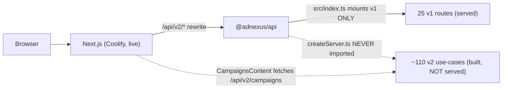

# AdNexus AI — Path to v1

> Status date: 2026-06-02
> Branch where this work landed: `fix/api-test-suite-green-2026-06-02`
> Supersedes the "Phases 1-5 COMPLETE" claims in [V2-ROADMAP.md](../V2-ROADMAP.md)
> (those were aspirational — the test suite was red and the v2 layer is not served).

This document is the single source of truth for what is actually done, what is
genuinely broken, and the prioritized path to a shippable v1. Every item has a
status, an owner-area, a test gate, and acceptance criteria.

## Where we are now (verified, not aspirational)

| Area | State |
|---|---|
| API tests (jest) | GREEN — 19/19 suites, 602 tests (was 4/18, 348) |
| API use-case tests (vitest) | GREEN — 8 files, 52 tests, now run by `pnpm test` (were orphaned) |
| Web tests (vitest RTL) | GREEN — real Next component tests (dead SPA tests deleted) |
| Typecheck (all 6 packages) | GREEN |
| Web build + Docker image | GREEN — boots, Coolify artifact valid |
| API Docker image | GREEN — builds from root context, boots, `GET /health` 200 |
| **v2 Clean Architecture at runtime** | **NOT SERVED — see P0-1** |
| **API production deploy** | Dockerfile now exists + verified; Coolify app still TODO (P0-2) |

See [architecture/test-coverage-matrix.md](architecture/test-coverage-matrix.md)
for the full coverage breakdown and the structural findings.

## The one thing that most threatens v1



The live Next dashboard calls `/api/v2/*`, but the deployed API
(`apps/api/src/index.ts`) mounts **only v1** and never imports the v2
`createServer.ts`. So v2 dashboard calls currently 404 in production unless a
page silently falls back. This is the headline P0.

---

## P0 — Ship blockers (must be done for v1)

### P0-1 — Wire the v2 Clean Architecture into the running server
- **Problem:** `apps/api/src/interface/http/createServer.ts` mounts 19 `/api/v2/*`
  route groups behind a DI container, but `src/index.ts` (the entrypoint) never
  calls it. The frontend depends on `/api/v2/campaigns`, `/api/v2/campaigns/summary`,
  `/api/v2/drafts`, etc.
- **Decision needed:** mount v2 inside the existing `index.ts` app, OR make
  `createServer.ts` the entrypoint and mount the stable v1 routers inside it.
- **Test gate:** new integration tests hitting `/api/v2/campaigns*` (auth, RBAC,
  the `{success,data}`/`{success,error}` envelope) pass; the existing v2 use-case
  unit tests already pass.
- **Acceptance:** every `/api/v2/*` route the live Next pages call returns 2xx with
  the documented envelope against a running server.

### P0-2 — Stand up the API as a Coolify app
- **Problem:** the API had no working container image; [.github/workflows/deploy.yml](../.github/workflows/deploy.yml)
  "deploys" the API with stub `echo` steps.
- **Done in this branch:** [apps/api/Dockerfile](../apps/api/Dockerfile) rewritten as a
  root-context pnpm multi-stage build; verified `docker build` + boot + `/health` 200.
- **Remaining:** create the Coolify app (build context = repo root, Dockerfile =
  `apps/api/Dockerfile`), wire env vars (the config schema fail-fasts on missing
  ones), point the Next app's `API_URL` at it.
- **Acceptance:** Next preview → API → DB round-trips on a deployed preview URL.

### P0-3 — Resolve the response-envelope contract across v1/v2/frontend
- **Problem:** three contradictory shapes exist for campaign list:
  v1 returns `{data:[...], total, page, totalPages}`; the e2e contract expected a
  nested `pagination` object; the live frontend expects `{data:{campaigns, total}}`.
- **Done:** error envelope unified to `{success:false, error:{code,message,details}}`;
  ZodError→400; `ConflictError`→409.
- **Remaining:** pick ONE success envelope for list endpoints and align route +
  frontend. Tie to P0-1 (the v2 routes are where this should land).
- **Acceptance:** frontend renders campaign/draft/audience lists against the served
  API with no shape adapters.

### P0-4 — Execute the dead-Vite-SPA deletion follow-through
- **Done:** 251 dead files removed, deps pruned, [ADR-003](architecture/ADR-003-frontend-framework.md)
  superseded, Next build + typecheck stay green.
- **Remaining:** none for v1 — but if any of the 65 SPA-only pages (marketing,
  compare, power-user tools) are wanted, port them into Next as a P1 backlog item.

### P0-5 — Critical-flow E2E green
- **Done:** auth signup, campaign CRUD (RBAC-guarded), draft create→approve→execute
  (real engine), alert→notification all covered and green.
- **Remaining:** billing plan-upgrade→Stripe-webhook→credits has only integration
  coverage; add an e2e once P0-1/P0-2 give a served billing surface.

---

## P1 — Needed soon after v1

- **Close remaining v2 `TODO` endpoints** the live pages need (per
  [V2-ROADMAP.md](../V2-ROADMAP.md) §3 `🔄 TODO` markers): campaign insights/history/sync
  detail, draft comments, audience duplicate/sync, report results/scheduled.
- **RBAC + audit coverage** for every mutating v2 route (the v1 campaigns RBAC hole
  this work fixed shows the pattern — viewers must not mutate).
- **Use-case unit tests** for the remaining ~104 untested use-cases (this branch
  added 6 critical-path ones as the template).
- **Frontend tests** for the rest of the live `components/*Content` (Dashboard +
  Campaigns done as the template).
- **Settings/profile, integrations connect/disconnect, exports download** —
  user-visible gaps flagged in the roadmap.

## P2 — Hardening / polish

- Load testing (roadmap §4 "future work").
- Observability: request metrics, P50/P95/P99, error-rate alerting (roadmap §9).
- Cursor pagination, field selection, ETag/conditional requests (roadmap §7.3).
- Stripe webhook e2e with signature fixtures.
- Re-enable a thin CI test gate (or keep agent-side `beast` gates) once v2 is served.

---

## Test gates (run before declaring any item done)

```bash
pnpm --filter @adnexus/api test     # jest (602) + vitest (52)
pnpm --filter @adnexus/web test     # RTL component tests
pnpm turbo typecheck                # all 6 packages
docker build -f apps/api/Dockerfile -t adnexus-api .   # API image
docker build -t adnexus-web .                          # web image
```

## What changed in this branch (summary)

- Repaired the API test infra (jest transform, vitest-leftover worker test) and
  triaged 250+ failures into infra fixes, stale-test updates, and a handful of
  real product bugs (error envelope, ZodError status, 409 conflicts, optional
  reject reason, null campaign hydration, billing HttpError status, v1 campaign
  RBAC hole).
- Deleted the dead Vite SPA, superseded ADR-003.
- Added v2 use-case unit tests + wired vitest into `pnpm test`.
- Added the alert→notification e2e and real Next RTL tests.
- Gave the API a working Dockerfile and verified the deploy path end to end.
