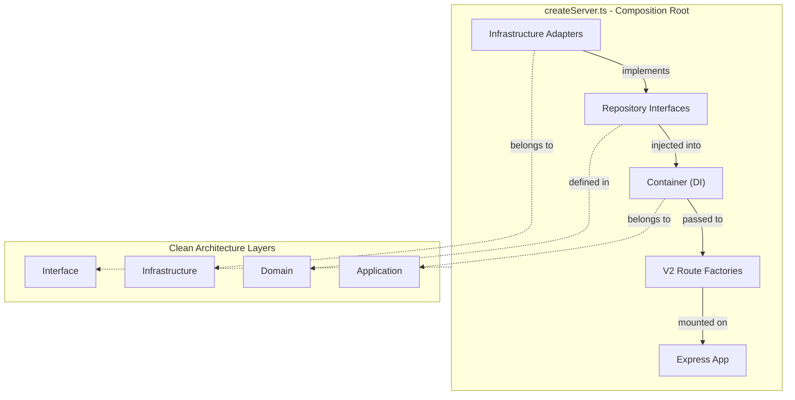

# Composition Root Pattern

**Last Updated:** 2026-05-30
**Source:** `apps/api/src/interface/http/createServer.ts`

## Overview

The composition root is the single location in the application where all infrastructure concerns are wired together. It sits in the outermost layer (`interface/http`) and is the only place where concrete implementations are coupled to their interfaces.

## Architecture



## Wiring Sequence

### Step 1: Instantiate Infrastructure Adapters

```typescript
// 13 repositories, each wrapping raw pg Pool queries
const campaignRepo = new CampaignRepository();
const draftRepo = new DraftRepository();
const workspaceRepo = new WorkspaceRepository();
// ... 10 more repositories
```

All repositories use the `query()` helper from `src/infrastructure/database/connection.ts` which wraps a shared `pg.Pool` instance.

### Step 2: Create Cross-Cutting Services

```typescript
const domainEventBus = new InMemoryEventBus();     // Domain events
const auditLogger = new SupabaseAuditLogger();      // Audit logging
const notificationService = new NotificationService(); // Notifications
const realtimeEventBus = new EventBus();             // SSE/WebSocket events
```

### Step 3: Build the Container

```typescript
const container = new Container({
  campaignRepository: campaignRepo,
  draftRepository: draftRepo,
  workspaceRepository: workspaceRepo,
  userRepository: userRepo,
  billingRepository: billingRepo,
  adRepository: adRepo,
  settingsRepository: settingsRepo,
  audienceRepository: audienceRepo,
  reportRepository: reportRepo,
  alertRepository: alertRepo,
  searchRepository: searchRepo,
  notificationRepository: notificationRepo,
  webhookRepository: webhookRepo,
  eventBus: domainEventBus,
  auditLogger,
  notificationService,
});
```

The `Container` class (`application/services/Container.ts`, 272 lines) takes a `ContainerConfig` and produces 63 use case instances, each with its specific dependencies injected via constructor.

### Step 4: Create Routes with Container

```typescript
app.use('/api/v2/campaigns', authenticatedRateLimiter, createCampaignRoutes(container));
app.use('/api/v2/drafts', authenticatedRateLimiter, createDraftRoutes(container));
// ... 10 more route groups
```

Each route factory function receives the `Container` and creates a controller that delegates to use cases.

## Container Internals

The `Container` is a manual DI container with these characteristics:

- **No decorators or reflection** - All wiring is explicit TypeScript
- **Constructor injection** - Every use case declares its dependencies in the constructor
- **Readonly properties** - Use cases are exposed as `readonly` properties for type safety
- **Flat structure** - No nested scopes or lifecycle management (singleton by default)

### Adding a New Dependency

To add a new entity with full Clean Architecture coverage:

1. Create domain entity in `domain/entities/`
2. Create repository interface in `domain/repositories/`
3. Create use case(s) in `application/use-cases/`
4. Create repository implementation in `infrastructure/repositories/`
5. Add repository to `ContainerConfig` interface
6. Instantiate repo in `createServer.ts` and pass to Container constructor
7. Wire new use cases to Container readonly properties
8. Create controller and route factory in `interface/http/`
9. Mount route in `createServer.ts`

## Request Flow

```
HTTP Request
  -> Express middleware (cors, helmet, rate limiting, auth)
  -> Route factory (e.g., createCampaignRoutes)
  -> Controller method (e.g., controller.create)
  -> Use case (e.g., CreateCampaignUseCase.execute)
  -> Repository interface (e.g., ICampaignRepository)
  -> Repository implementation (e.g., CampaignRepository)
  -> pg Pool query
  -> Result<T> returned up the chain
  -> Controller maps Result to HTTP response
```
