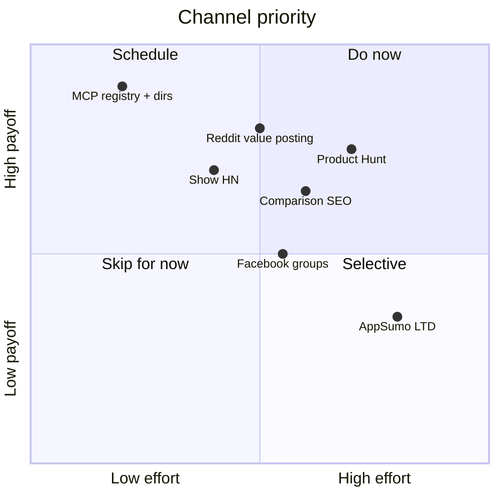

# AdNexus AI - Distribution Channels & Posting Plan

Three phases, sequenced from zero-cost MCP reach -> intent communities -> launch moments.
Golden rule for every community: **participate value-first with personal accounts; never
brand-spam.** Reddit/Quora comments are permanent SEO assets that rank on Google and feed
AI search answers.

> **DECIDED - launch order is MCP-first.** Phase A (MCP registry + directories) runs to
> completion and proves trial activation before the Phase C Product Hunt / Show HN moment.
> Do not front-load the PH/HN spike onto an unproven funnel.

## Phase A (Weeks 0-2) - MCP wedge, free reach

The single highest-leverage action: get the MCP server discoverable.

- [ ] Package the MCP server (`apps/mcp/`) for distribution: publish to **npm** (npx) and/or **PyPI** (it's FastMCP/Python).
- [ ] Publish to the **official MCP Registry** (`registry.modelcontextprotocol.io`) via the
      `mcp-publisher` CLI + a `server.json` manifest. Authenticate via GitHub or DNS.
- [ ] Submit to community directories (most ingest from the official registry; some need a 2-min manual submit):
  - [ ] Glama (`glama.ai/mcp/servers`)
  - [ ] Smithery (`smithery.ai`)
  - [ ] MCP Market (`mcp.market`)
  - [ ] FindMCP (`findmcp.dev`, 8,000+ servers indexed)
  - [ ] AI Agents Directory (`aiagentsdirectory.com`)
  - [ ] Cline MCP Marketplace
- [ ] Post a build-in-public demo thread (chat -> draft -> approve -> live) on **r/mcp,
      r/ClaudeAI, r/cursor**. Lead with the 20-second screen recording, not the pitch.

## Phase B (Weeks 2-6) - intent communities

### Reddit (personal accounts, target "what's the best tool for X" threads)

| Subreddit | Size | Intent | Use |
|---|---|---|---|
| r/PPC | ~120K | High | Primary - ad management/attribution tool discussion |
| r/FacebookAds | - | High | Meta-buyer pain threads |
| r/PPCMarketing | - | High | Tool recommendation threads |
| r/agency | - | High | Agency-owner multi-account/white-label pain |
| r/digital_marketing | ~200K | Medium | Broader awareness |
| r/SaaS | - | Medium | Build-in-public, pricing experiments |
| r/marketing | ~800K | Medium | Awareness only |
| r/Entrepreneur | - | Medium | Founder story |

Cadence: answer 80% of the time with zero product mention; soft-mention AdNexus only on
genuine "best tool for X" threads, as one option among several.

### Slack / Discord

- Performance-marketing + agency-owner communities, RevOps/growth cohorts, indie-hacker
  Discords. Contribute expertise; never drop links cold.

### Facebook Groups

- Large media-buying / e-com scaling groups. Lead with a free **"AI ad audit" lead magnet**
  (read-only Free tier), not a pitch.

## Phase C (Week 6+) - launch moments

- [ ] **Product Hunt** - build the waitlist + line up first-50 supporters *before* launch day.
      PH rewards pre-built relationships, not cold launches.
- [ ] **Hacker News - Show HN** - the MCP + draft-first safety angle is HN-native. Title:
      "Show HN: Manage your Meta/Google/TikTok ads from Claude (draft-first MCP server)".
- [ ] **LinkedIn** - founder narrative posts + direct agency-owner outreach.
- [ ] **AppSumo / LTD** - only if cash flow needs a bump. Caution: attracts churny non-ICP.

## Always-on - content / SEO ("you can't outspend, out-teach")

- Comparison pages already exist in-app: `CompareMadgicx`, `CompareBirch`, `CompareSmartly`,
  `CompareAdKit`, `ComparePipeboard`. Drive SEO to them.
- Tutorials: "Manage Meta ads from Claude", "Set up the AdNexus MCP server in Cursor".
- Link bait: the existing `ToolsROASCalculator` + a learning-phase calculator.

## Channel priority (effort vs payoff)

