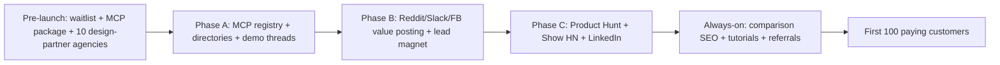

# AdNexus AI - Launch Sequence & First-100 Playbook

## End-to-end sequence

## Pre-launch (before any public post)

- [ ] Stand up a **fake-door landing page** with the category line and a waitlist email capture.
- [ ] Run **$100 of test ads** to the landing page to validate the messaging (target: 5%+ visitor->email).
- [ ] Recruit **10 design-partner agencies**: free Agency tier in exchange for feedback + a logo/testimonial.
- [ ] Harden the **Meta integration** first (depth over breadth) - it's the most-used platform.
- [ ] Package + publish the MCP server (see [`04-distribution.md`](04-distribution.md) Phase A).

## First-100 customers - the tactics that actually work

1. **Direct, personalized outreach** to ~200 ICP-matched agencies/buyers (non-template;
   reference their specific stack/pain). Offer a free audit, not a demo.
2. **Inbound from MCP directories** - the wedge audience installs the server, hits the Free
   tier, and self-serves into a trial.
3. **Reddit SEO compounding** - value comments on "best tool for X" threads keep returning leads.
4. **Design-partner referrals** - each of the 10 agencies refers 1-2 peers (warm, high-convert).

## Activation checklist (what a new signup must do in 7 days)

- [ ] Connect 1 ad account (Meta).
- [ ] Receive 1 Morning Brief.
- [ ] Review + approve 1 AI draft.
- [ ] (Power users) Connect the MCP server in Claude/Cursor and run 1 tool call.

> Activation drives 60-75% of trial-to-paid variance. If a cohort isn't hitting 3+ of these
> in 14 days, fix onboarding before touching pricing or acquisition.

## Product Hunt mini-runbook

- T-2 weeks: line up a hunter + DM your waitlist + design-partner agencies to support.
- T-1 day: finalize gallery (the chat->draft->approve->live GIF is the hero asset).
- Launch 00:01 PT: post, then personally thank every commenter; answer fast.
- Offer a PH-only code (e.g. 3 months of Team at Growth price) to convert the spike.

## Show HN mini-runbook

- Title leads with the MCP + safety angle, not the brand.
- First comment from the founder: the honest "why we built it" + a link to the open MCP server.
- Expect scrutiny on data access + API ToS - answer with the draft-first/audit story.
