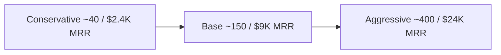

# AdNexus AI - Growth Scenarios (12-month)

All figures illustrative, for planning - not forecasts.

## Shared assumptions

- Blended ARPU ≈ **$60/mo** (mix of $49 Growth and $149 Team, a few $399 Agency).
- Monthly logo churn target **< 5%**.
- Reverse-trial -> paid ≈ **20-24%**.
- No paid-acquisition dependency; growth from MCP directories + Reddit SEO + PH/HN + referrals.

## Scenarios

| Scenario | Paying @ M12 | MRR @ M12 | ARR | What it takes |
|---|---|---|---|---|
| Conservative | ~40 | ~$2.4K | ~$29K | MCP directory + Reddit inbound only; minimal spend |
| Base | ~150 | ~$9K | ~$108K | PH launch + compounding comparison SEO + 10-15 agencies on Team/Agency |
| Aggressive | ~400 | ~$24K | ~$290K | A hit PH/HN launch + a working referral loop + 30+ agencies anchoring revenue |

## The dominant lever: tier mix, not signup volume

One **$149 Team** agency ≈ **3x** a $49 Growth seat; one **$399 Agency** ≈ **8x**. So the
mix between solo seats and agency seats moves ARR far more than raw signup count.

| Mix at 150 customers | Implied MRR | Comment |
|---|---|---|
| 80% Growth / 20% Team | ~$10.3K | Solo-heavy; lower retention risk |
| 50% Growth / 35% Team / 15% Agency | ~$13.7K | Balanced - the target mix |
| 30% Growth / 40% Team / 30% Agency | ~$18.7K | Agency-led; highest ARR + stickiness |

## Sensitivity to churn

At base (150 customers, ~$9-13K MRR), moving monthly churn from **5% -> 3%** is worth more
than a 25% bump in top-of-funnel signups, because retained agencies compound. **Retention
work > acquisition work** once the first 50 paying are in.

## Leading indicators to watch weekly

- MCP server installs (directory + npm/PyPI downloads).
- Trial starts and 7-day activation rate (the 4-item checklist in `05-launch-sequence.md`).
- Trial -> paid conversion by cohort.
- Agency-tier share of new MRR.
- Logo + revenue churn.
