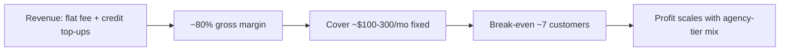

# AdNexus AI - Bootstrap Financial Model

Illustrative, bootstrap-mode. The thesis: **profitable-by-design** because there is no
paid-acquisition dependency and the credit model caps COGS.

## Cost structure (variable / COGS)

| Cost | Driver | Control lever |
|---|---|---|
| LLM tokens | AI actions (briefs, recs, anomaly explanations, NL queries) | **Credit metering** (`ai_credits` + `credit-tracker`) |
| Platform API calls | Meta/Google/TikTok/Snap sync | Cache + batch; respect rate limits |
| Hosting | Coolify app + DB + MCP | Single VPS at low scale |
| Vector/RAG (optional) | Reuse Beast Qdrant + Voyage (see open RAG plan) | Shared infra, not net-new spend |

LLM unit costs have fallen ~80% since 2024, so the credit allotments in
[`03-pricing-packaging.md`](03-pricing-packaging.md) leave healthy headroom. **Target COGS
< 20% of revenue** -> gross margin ~80%+.

## Fixed / one-time (Year-1 cash out)

Keep total Year-1 spend in the **low five figures**:

- Domain + email: ~$50-150/yr.
- Hosting (Coolify VPS + DB): ~$30-80/mo.
- Stripe fees: ~2.9% + 30c per charge (variable, in COGS-adjacent).
- A little paid testing ($100-500 for fake-door validation + small PH boost).
- Design polish / misc tooling: a few hundred.
- **No salary draw assumed** - classic bootstrap.

## Unit economics (per paying customer, blended)

| Metric | Value (illustrative) | Note |
|---|---|---|
| ARPU | ~$60/mo | Mix of $49/$149/$399 |
| Gross margin | ~80% | Credit-capped COGS |
| Gross profit / customer | ~$48/mo | |
| CAC | ~$0-low | Directories + Reddit SEO + referrals |
| Payback | ~immediate | No paid acquisition to recover |

## Break-even

Fixed monthly run-cost (hosting + tooling) is roughly **$100-300/mo** at launch scale.

- Break-even ≈ **$300 / $48 ≈ 7 paying customers** to cover fixed costs.
- The **Conservative** scenario (~40 paying) clears fixed + variable cost with room to spare.
- The model is cash-positive well before M12 in all three scenarios in
  [`06-growth-scenarios.md`](06-growth-scenarios.md).

## Why pricing protects margin

- Credits cap the heaviest AI users (they buy top-ups instead of eroding margin).
- The Agency tier's higher fee **cross-subsidizes** Free-tier infra cost (the directory magnet).
- No ad-spend-percentage model means our cost never balloons with a customer's budget.

## What would break the model

- A generous, uncapped Free tier (infra bleed) -> keep Free read-only + capped.
- Heavy reliance on paid ads (kills the zero-CAC thesis) -> stay organic/community-led.
- Solo-seat-only mix with high churn -> bias to agencies for retention (see growth doc).
