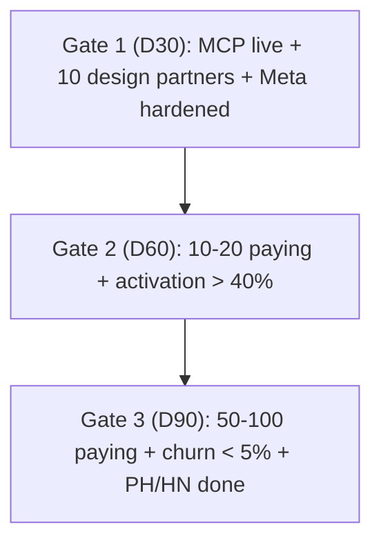

# AdNexus AI - 90-Day Milestones

## Day 0-30 - Foundation + wedge

- [ ] MCP server packaged (npm/PyPI) and live on the **official MCP Registry** + 5 directories.
- [ ] Fake-door landing page + waitlist capture live; $100 validation ad test run.
- [ ] 10 design-partner agencies recruited (free Agency tier).
- [ ] Meta integration hardened (depth-first).
- [ ] Reverse-trial billing path scoped (full 14 days -> Free).

## Day 31-60 - Demand + funnel

- [ ] Reddit/Slack/FB value-posting cadence running (personal accounts, value-first).
- [ ] "AI ad audit" lead magnet (Free read-only tier) promoted in FB media-buying groups.
- [ ] 3 comparison SEO pages pushed (`CompareMadgicx`, `CompareBirch`, `CompareSmartly`).
- [ ] Reverse-trial billing live; credit counts surfaced on pricing cards.
- [ ] **First 10-20 paying customers.**

## Day 61-90 - Launch + scale

- [ ] **Product Hunt + Show HN** launch (waitlist + supporters pre-lined).
- [ ] Referral incentive shipped (design-partner agencies refer peers).
- [ ] 2nd/3rd platform live (Google, then TikTok).
- [ ] Push toward **50-100 paying** and **< 5% monthly churn**.

## Milestone gates (don't advance until met)

- **Gate 1 -> 2:** only start heavy community posting once the product activates a connected account end-to-end.
- **Gate 2 -> 3:** only launch on PH/HN once trial activation is > 40% (otherwise you burn the spike).
